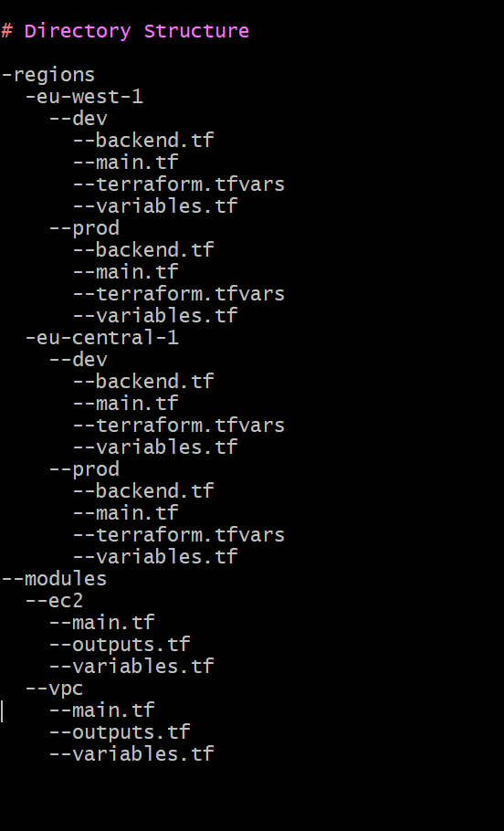

# Altschool_Cloud_3rd_Semester_Assignments

This is assingnment no 1, that deals with the use of terraform to provision and manage infrastructure on AWS

Terraform_Assignment1

Using Terrafrom create an aws instance (ubuntu) in multiple regions (free-tier) (eu-west-1 and eu-central-1)
- should be on minimum of 2 availablity zones
- should be reuseable
- can be built on multiple environments (dev, prod)
- should have a script that creates ansible, docker container
- your scripts should be modularized
- create a vpc to represent each environment

# Introduction

This is a detailed overview of the use of Terraform to deploy and manage infrastructure on AWS. The task is organized into modules for VPC creation and EC2 instances provisioning, built across multiple environments (dev, and prod) both on different regions (eu-west-1 and eu-central-1) with a minimum of 2 availability zones. At the user data section of the EC2 creation, there is a bash script to install ansible and docker on the EC2 instances. The modules are designed to be reusable, flexible and scalable.

# Prerequisites

The necessary prerequisites are as listed bellow:

- Open an AWS account with appropriate credentials.
- AWS CLI installed and configured.
- Terraform installed on the local machine.

# Directory Structure

-regions
  -eu-west-1
    --dev
      --backend.tf
      --main.tf
      --terraform.tfvars
      --variables.tf
    --prod
      --backend.tf
      --main.tf
      --terraform.tfvars
      --variables.tf
  -eu-central-1
    --dev
      --backend.tf
      --main.tf
      --terraform.tfvars
      --variables.tf
    --prod
      --backend.tf
      --main.tf
      --terraform.tfvars
      --variables.tf
--modules
  --ec2
    --main.tf
    --outputs.tf
    --variables.tf
  --vpc
    --main.tf
    --outputs.tf
    --variables.tf

    

# VPC-networks Module

The Virtual Private Cloud (VPC) module in the directory structure will create the following on AWS:

- Virtual Private Cloud (VPC)
- Internet Gateway (IGW)
- Data block for availability zones
- Public Subnet 
- Route Table
- Route Table Association

# ec2-instance Module

The Instances module (`modules/instances`) provisions EC2 instances in both public and private subnets. It includes:

- Using Data block to retrieve the corresponding ami for Ubuntu 20.04 LTS in the respective region
- Key Pair Generation: both the private and the public keys
- Create Public Instances
- Security group creation

